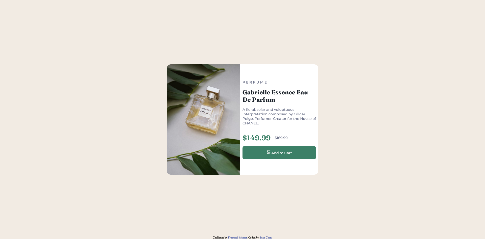

# Frontend Mentor - Product preview card component solution

This is a solution to the [Product preview card component challenge on Frontend Mentor](https://www.frontendmentor.io/challenges/product-preview-card-component-GO7UmttRfa). Frontend Mentor challenges help you improve your coding skills by building realistic projects. 

## Table of contents

- [Overview](#overview)
  - [The challenge](#the-challenge)
  - [Screenshot](#screenshot)
  - [Links](#links)
- [My process](#my-process)
  - [Built with](#built-with)
  - [What I learned](#what-i-learned)
  - [Continued development](#continued-development)
- [Author](#author)

## Overview

### The challenge

Users should be able to:

- View the optimal layout depending on their device's screen size
- See hover and focus states for interactive elements

### Screenshot

### Links

- Solution URL: [Add solution URL here](https://your-solution-url.com)
- Live Site URL: [Add live site URL here](https://your-live-site-url.com)

## My process

### Built with

- HTML5/CSS3
- Flexbox
- Mobile-first workflow

### What I learned

I have learned how to utilize flexbox and use the chrome developer tools to test out what CSS syntax is needed to set up `display: flex;`. Also, this is the first project where I utilized the mobile first approach. Overall, utilizing the mobile first approach not only makes my CSS code efficient but also organized as it allows me to only add what is needed for the desktop version without having to repeat CSS code for each class.

### Continued development

For the future, I plan to refine the solution more when I get the chance.

## Author

- Website - [Sean Chen](https://chenmeister.github.io/)
- Frontend Mentor - [@chenmeister](https://www.frontendmentor.io/profile/chenmeister)
